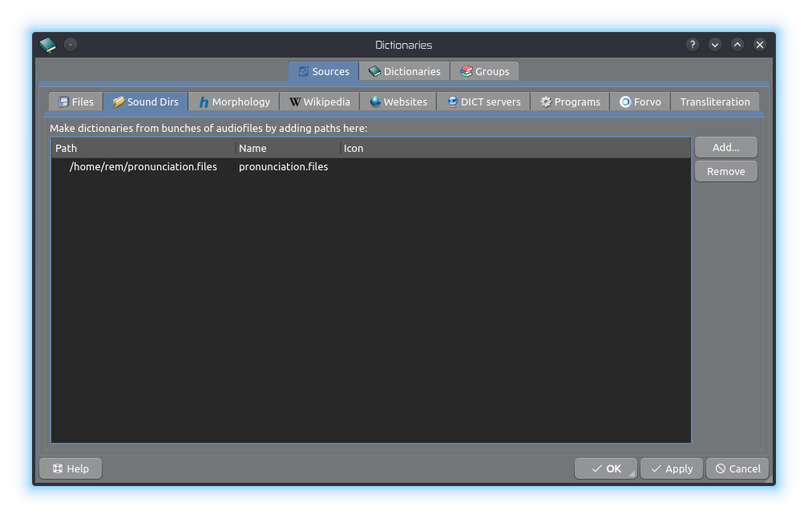
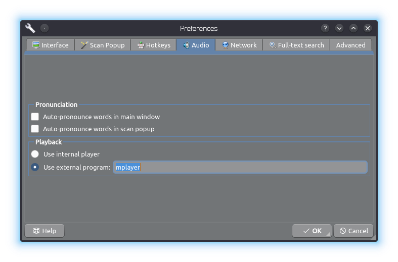

# pronunciations

If you have ever wondered to have an offline dictionary with full pronunciations (like Google voice), you are at the right place.

With your own `words.txt` and `generate.sh` script, you can mass download the words in your `words.txt` with Google voice as `mp3` files.

If you don't have the time and/or resources needed, you can download ready made files. There are `mp3` folders named `A-Z` or you can download `pronunciations.zip` which has all `A-Z` in one shot.

## Using with Goldendict

Create a directory like `pronunciations.files` in your home and put `A-Z` directories inside it.

In Goldendict from menu `Edit -> Dictionaries` go to `Sound Dirs` and `Add...` `pronunciations.files` as sound directory.

Make sure you have a working sound player in Goldendict. To do so, in Goldendict from menu `Edit -> Preferences -> Audio` set your audio player (`mplayer` is default but you can for example use vlc).

Here is [Mediafire link](https://www.mediafire.com/folder/wc35mt3qt7ulw/English) to audio files
(either download `A-Z` files or `pronunciations.files.zip`).